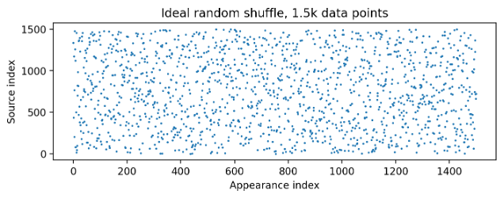
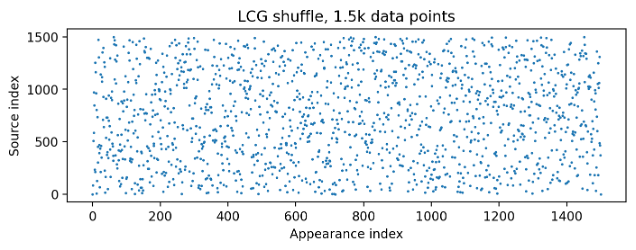
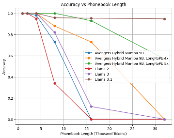

# Announcing Bamba

  

Transformer models are increasingly being deployed in real-world applications, but they face GPU memory bandwidth bottleneck during inference. These bottlenecks arise during the per-token decoding step, during which a lot of data needs to move between the GPU memory (where the model weights and KV caches are located) and the compute units (where computations happen). Since the KV cache scales linearly with sequence length, for longer sequences, the data movement between memory and compute units is dominated by the KV cache. Initially, transformer models only supported smaller sequence lengths (2K, 4K, etc.), but as they support longer and longer sequence lengths (e.g., [Meta’s Llama 3.1](https://huggingface.co/meta-llama/Llama-3.1-8B) (128K tokens), [IBM’s Granite Code v3](https://huggingface.co/ibm-granite/granite-3b-code-base-128k) (128K tokens), and [Mistral Large](https://huggingface.co/mistralai/Mistral-Large-Instruct-2411) (32K tokens)—the memory bandwidth bottleneck becomes more pronounced.

While techniques like lower precision, layer pruning, and compression can reduce KV-cache size, they do not address the root cause. To tackle the issue, a new class of architectures that maintain a constant-size state (regardless of sequence lenght) has emerged, including [Mamba](https://arxiv.org/abs/2312.00752), [Griffin](https://arxiv.org/abs/2402.19427), and [DeltaNet](https://arxiv.org/abs/2406.06484). Among these, the mamba architecture has received widespread community attention, with several architectural variations being proposed to demonstrate its potential over the past year. 

To briefly summarize these community efforts, we note that the original mamba models demonstrated promising results but lagged behind contemporary transformer models in various LLM benchmarks. To address these gaps, Jamba and Samba interleaved tranditional transformer layers with mamba layers and created mamba hybrid models which improved their benchmark performance while largely maintaining the efficiency of the decoding phase for large sequence lengths. Mamba2 is an evolution of the original mamba architecture which is more efficient to train and infer than the original mamba architecture. The Codestral Mamba model is based on purly mamba2 architecture and shows SOTA results on coding tasks without any tranformer layers. The NVIDIA Mamba2 hybrid model interleaves mamba2 layers with transformer layers and demonstrates comparable performance to pure transformer models on 23 long-context tasks in addition to traditional LLM benchmarks. More recently, the Falcon mamba model was introduced which shows SOTA results on HF leaderboard v1 and v2 benchmarks. 

We introduce Bamba-9B, a 9B mamba2 hybrid model that further adds to the proof points of the emerging model architectures. Inspired by AllenAI, in this collaboration between IBM, Princeton, CMU, and UIUC, we provide the entire lineage of data for training, multiple model checkpoints, and the code for pretraining. Note that the checkpoints being released were pretrained (and annealed) using datasets that do not contain any benchmark-aligned instruction data with the exception of FLAN dataset (as we believe including instruction data during pretraining/annealing reduces model's fine tuning flexibility. We hope this will allow community to take these checkpoints and further create models that are annealed and fine-tuned for downstream tasks. To faciliate reproducibility and further enhancements, we are also releasing a dataloader that uses distributed stateless shuffle to enable feature such as continuing from a model checkpoint without repeating previously seen tokens or to reproduce the run entirely from scratch. We also enable this model in key OSS communities -- Hugging Face `transformers`, `TRL`, and `vLLM` to allow developers to use the model from the get go. We will share the details of our learnings when training this model and welcome the community to help further close the gap with SoTA open-source models and bring Mamba architecture to mainstream models and alleviate the KV-cache bottleneck.

## Evaluations

We break our evaluations into three parts:
1. Comparison with Mamba architecture based language models
2. Comparison with transformers trained to similar tokens
3. Comparison with SoTA transformer models of similar size

We rerun all the benchmarks for benchmarking all models except the NVIDIA Hybird Mamba model  where we use the output from the Live leaderboard (we could not run this for NVIDIA Hybird Mamba model as the model weights are not in Hugging Face transformers compatible format, hence we report the numbers from the paper). For the v2 leaderboard results, we perform [normalization](https://huggingface.co/docs/leaderboards/open_llm_leaderboard/normalization) and report the normalized results.

TL;DR
We find that Bamba-9B adds another proofpoint to the compititive performance of hybrid mamba models vis-a-vis transformer models. Compared to SoTA transformer models, Bamba 9B has gaps in math benchmarks and MMLU (without these benchmarks, the average scores are nearly equal to Meta Llama 3.1 8B with 48.01 and 48.22 as the averages). Our experiments show that this gap can be closed by (a) training Bamab-9B for more tokens (MMLU has steadily increased during pretraining); and (b) including quality math data during pretraining/annealing phases. Given these findings, we plan to continue pretraining the current versions with newer datasets such as [Olmo2 mix](https://huggingface.co/datasets/allenai/olmo-mix-1124), and anneal them using benchmark-aligned annealing data mixes such as [Dolmino mix](https://huggingface.co/datasets/allenai/dolmino-mix-1124).

Bamba-9B results also dispell any concerns that one might have from relatively low-scoring NVIDIA Hybrid Mamba2 model in leaderboard benchmarks. Recall that NVIDIA Hybrid Mamba2 model was trained on an older data mix and the goal of the study was to compare different model architectures by training them on the same data mix. In line with the findings of NVIDIA Hyrbid Mamba2 study, Bamba-9B adds further evidence that Hyrbid Mamba2 architecture provides competitive performance while providing inference efficiencies that could be as large as 4x. 

### Comparison with Hybrid Architectures
Several Mamba based architecture models have started coming up in the last 6 months (e.g., NVIDIA Hybrid Mamba2, Codestral Mamba, Falcon Mamba, Zamba7Bv1) furthering the performance of these architectures and demonstrating their inference performance as well as closing the gap with quality. We compare 8 key benchmarks across Bamba, NVIDIA Hybrid model, Zamba, and Falcon Mamba. Falcon Mamba is a pure Mamba model, Zamba has shared attention layer for every 6 Mamba layers, and Bamba and NVIDIA are both Hybrid models with full attention layers interspersed with Mamba2 layer. While Falcon Mamba performs the best overall and has been trained to 5.5T tokens, there are open questions on how well it will perform on long-context tasks where mamba-based architectures truly shine in inference performance. Zamba was trained on fewer tokens (1T), but with a different Hybrid architecture and datasets that had benchmark-aligned instruction datasets generated from more powerful langauge models. Bamba and NVIDIA Mamba are quite similar to each other (details on differences are summarized in the model architecture section), but Bamba is trained to 2.2T and NVIDIA Hybrid Mamba is trained to 3.5T tokens.
  
| Benchmark score   | Bamba 9B   | NVIDIA Mamba2 Hybrid 8B* | Zamba 7B   | Falcon Mamba 7B   |
|-------------------|------------|-------------------------|------------|-------------------|
| MMLU (5-Shot)      | 60.77      | 53.6                   | 57.85      | **63.19**         |
| Hellaswag         | 81.8       | 77.69                  | **82.27**  | 80.82             |
| Winogrande        | 76.87      | 71.27                  | **79.32**  | 78.14             |
| Piqa              | 82.26      | 79.65                  | 82.21      | **83.62**         |
| OpenbookQA        | 47.6       | 42.8                   | 46.8       | **47.8**          |
| ARC-C             | 63.23      | 47.7                   | 55.38      | **63.4**          |
| TruthfulQA        | 49.21      | 38.72                  | 49.69      | **53.46**         |
| **Average**       | 65.96      | 58.78                  | 64.79      | **67.2**          |

\* Results are taken from [NVIDIA paper](https://arxiv.org/pdf/2406.07887)

The take away from this table is that hyrbid mamba2 architecture can deliver competitive results while being nearly as efficient to train as transformer models. Furthermore, they can deliver significant improvement (theoretically up to 5x) in inference efficiency despite having full attention layers interspersed with mamba2 layers. We are continuing to pretrain the Bamba model with latest datasets and plan to release future checkpoints as the model gets better.

## Comparison with transformers with similar token budget
We pick a few promiment models: Olmo 7B trained on identical data (2024), Meta Llama2 7B (2023), and IBM Granite 7B (2023), which have been trained to 2T tokens. While Olmo 7B outperforms Meta Llama2 and IBM Granite models across these 8 benchmarks, we note that with the same dataset, Bamba outperforms Olmo 7B. The main takeaway is that the Bamba model does as well or better than the tranformer models trained on the same dataset with similar token budget.

| Benchmark score   | Bamba 9B   | Olmo1.5 7B   | Meta Llama2 7B   | IBM Granite 7B   |
|-------------------|------------|--------------|------------------|------------------|
| MMLU (5-Shot)     | **60.77**  | 53.39        | 46.87            | 49.02            |
| Hellaswag         | **81.8**   | 78.65        | 78.59            | 77.0             |
| Winogrande        | **76.87**  | 72.77        | 74.03            | 70.17            |
| Piqa              | **82.26**  | 78.4         | 79.0             | 80.14            |
| OpenbookQA        | 47.6       | **50.2**     | 44.0             | 40.8             |
| ARC-C             | **63.23**  | 48.5         | 53.07            | 49.91            |
| TruthfulQA        | **49.21**  | 36.0         | 38.76            | 38.7             |
| **Average**       | **65.96**  | 59.7         | 59.19            | 57.96            |

### Comparison with SoTA transformer models

Finally, we compare with SoTA transformer models (Meta Llama 3.1 8B, IBM Granite v3 8B, and Olmo2 7B). For the missing benchmark results in HF leaderboard, we rerun the benchmarks (marked with a *). We observe that while there are obvious benchmark gaps, it is not clear that these gaps can be attributed to the defficiencies of the mamba architecture. In fact, a careful analysis of results shows that gaps are largly due to amount of data used for training models and inclusion of benchmark-aligned instruction datasets during the annealing phase. For example, we had one small scale run that added `metamath` and improved our `GSM8k` score from `36.77` to `60.0`.

[HF LLM- V1](https://huggingface.co/docs/leaderboards/en/open_llm_leaderboard/archive):

| Benchmark score | Bamba 9B | Falcon Mamba 7B | Meta Llama 3.1 8B | IBM Granite v3 8B | Olmo2 7B |
|-----------------|----------|------------------|-------------------|-------------------|-----------|
| MMLU           | 60.77    | 63.19           | **66.26**         | 65.45             | 63.96     |
| Hellaswag      | 81.80    | 80.82           | 81.98             | **83.29**         | 81.93     |
| Winogrande     | 76.87    | 78.14           | 77.51             | **80.82**         | 77.03     |
| ARC-C          | 63.23    | 63.40           | 57.85             | 63.74             | **64.51** |
| TruthfulQA     | 49.21    | **53.46**       | 45.16             | 52.89             | 43.32     |
| GSM8K          | 36.77    | 52.08           | 49.96             | 62.55             | **68.01** |
| **Average**    |  57.86    |   61.13       |    60.17        |    **64.69**         | 62.18     |

[HF LLM- V2](https://huggingface.co/docs/leaderboards/open_llm_leaderboard/about) + OpenbookQA and PIQA (all scores are normalized):

| Benchmark score | Bamba 9B | Falcon Mamba 7B | Meta Llama 3.1 8B | IBM Granite v3 8B | Olmo2 7B |
|-----------------|----------|------------------|-------------------|-------------------|-----------|
| MMLU PRO       | 17.53    | 14.33           | 25.46             | **25.83**         | 22.79     |
| BBH            | 17.40    | 19.88           | 25.16             | **28.02**         | 21.69     |
| Piqa           | 82.26    | **83.62**       | 82.54             | 82.41             | 81.39     |
| OpenbookQA     | 47.60    | 47.80           | 46.80             | 47.60             | **49.20** |
| MuSR           | 9.59     | 9.88            | 8.72              | 9.32              | **10.02** |
| GPQA           | 4.14     | 8.17            | 8.61              | **9.06**          | 4.92      |
| MathLvl5       | 1.66     | 4.0             | 5.14              | **9.82**          | 4.38      |
| **Average**    |   25.42   |    28.53       |      27.11      |     **32.83**       |  27.0     |  

We invite the community to help improve the model further and identify any fundamental limitations in this inference efficient model.

## Inference efficiency
The **KV-cache bottleneck** is the biggest challenge for Large language models and the community has furiously pursued addressing this issue through different approaches - quantization, pruning for standard transformers and of course novel model architectures such as Mamba2, Linear transformers, and Retnets. Realizing inference gains at production time is non-trivial even for changes to standard transformers - typically needing custom kernels that scale with the problem size. One key reason to pursue Mamba2 architecture is to build on the momentum of availability of kernels in the community. This effort furthers the progress by fixing issues in the core Mamba2 kernels via the popular vLLM model serving framework.

Our current progression of integration into vLLM can be tracked via [this PR](https://github.com/vllm-project/vllm/pull/10909). We use this PR to benchmark the inference latencies against a typical transformer architecture; we pick Meta Llama 3.1 8B because of its popularity and that it will be highly optimized. We use an NVIDIA H100 80GB GPU for obtaining our measurements and use our measurement framework to obtain throughput in tokens/second. We pick input size as 1K tokens and generate varying outputs (from 2K to 64K) and at varying batch sizes. We plot for different sequence lengths (8k to 64k) both the throughput and latencies compared to Llama 3.1 8B. We observe that as batch size and sequence lengths increase, Bamba outperforms a similar sized transformer model by a margin of 2x in throughput and latency. From an inference standpoint, these architectures benefit both latency for real-time applications as well as utilization of the GPU. Note that ratios greater than 1 for throughput are beneficial and latencies less than 1 are beneficial.

|  |  |
|:--:|:--:|
| **Figure 1:** Throughput improvements of Bamba | **Figure 2:** Latency improvements of Bamba |

Our analysis indicates that on a H100 NVIDIA GPU, we expect 4-5x speedup when inference shifts to a memory bottleneck (which typically happens in production settings). However, we have not realized that in vLLM because of two primary reasons: (i) chunked pre-fill is not supported for Bamba and any Mamba2 based architectures, (ii) memory allocation is assuming standard transformer KV-cache, and (iii) kernels are not optimized for inference. These issues are being tracked [here](https://github.com/foundation-model-stack/bamba/issues/3).

## Model architecture
We base our model architecture on the NVIDIA Hybrid Mamba2 with the following changes.
| Parameter | Bamba 9B | NVIDIA Hybrid Mamba2 8B |
|---------|-------|-------|
| Num layers | 32 | 29 |
| Num attention layers | 3 | 4 |
| Num Mamba2 layers | 29 | 25 |
| MLP expansion factor | 3.5 | 4 |
| Vocab size | 128k | 256k |
| Non-embedding parameters | 8.8B | 8.6B |
| RoPE | yes | no |
| Gated linear units | yes | no |

We have a total of 8B parameters in the Mamba2 layers, 800M in full attention layers, and 1B in embeddings. The hidden state is 4K, GQA for full attention with 8 KV-heads and 32 heads, Mamba2 layer head dimension is 64, and convolution filter size is 4.

## Data
Open source data has come a long way since the inception of Pile. When we started training this model, the best open source data was Dolma v1.7 which was shown to be quite performant through [Olmo models](https://allenai.org/olmo) and [ablations](https://huggingface.co/spaces/HuggingFaceFW/blogpost-fineweb-v1) by the Hugging Face data team. Since then, several other higher quality open source datasets have been released such as [DCLM](https://www.datacomp.ai/dclm/), [FineWeb-2](https://huggingface.co/collections/HuggingFaceFW/fineweb2-6755657a481dae41e8fbba4d), and Olmo mix.

We use Dolma v1.7 for the first phase of training and the data mixes chosen are illustrated below. For the second phase of training, we use [Fineweb-edu](https://huggingface.co/datasets/HuggingFaceFW/fineweb-edu) and [Cosmopedia](https://huggingface.co/datasets/HuggingFaceTB/cosmopedia) datasets. These datasets are downloaded in their raw form and we tokenize them using the [Ray framework](https://github.com/ray-project/ray) running on an internal large scale [Red Hat Open Shift](https://www.redhat.com/en/technologies/cloud-computing/openshift) cluster. We plan to release the tokenized and formatted parquet data soon for reproducibility.

<strong>Data mix for pretraining phase one</strong>

## Pre-Training
Pre-training Bamba was done in a phased manner, we performed ablation experiments at 1.8B model size and a few 100B tokens to determine the right learning rates and built on the previous community efforts. Based on the promising results from this study, we scaled the model to 3B and 2T tokens using Dolma mix. We also trained a 3B transformer model following Meta Llama architecture with the same data mix and observed similar or better performance from the Bamba model. Finally, we scaled the model to 9B size and leveraged PyTorch FSDP to train the model. 

We used a cosine learning rate schedule, with a peak learning rate of `3e−4`, a quadratic warmup over 2000 steps, decay factor of 0.033, and an ending learning rate of `1e−5` over 2T tokens. We use the AdamW optimizer with `β1` of 0.9 and `β2` of 0.95. We use a weight decay of 0.1, sequence length of 4096, and a global batch size of 1.5M tokens/batch. We used 192 A100 GPUs from the [IBM Cloud Vela](https://research.ibm.com/blog/AI-supercomputer-Vela-GPU-cluster) production cluster to train this model over a period of 2 months. This cluster runs on Red Hat Open Shift platform and is built on IBM's full stack (e.g., PyTorch, vLLM). We experienced 3 job interruptions, which were attributed to incorrect deployment of jobs and hardware failures. The hardware related job failures were detected automatically using [autopilot](https://github.com/IBM/autopilot).

We also performed a second phase training with high quality data from Hugging Face FineWeb-edu and Cosmopedia for an additional 200B tokens. We use a learning rate of 2e−5 and a cosine schedule to anneal the model, which helps improve our scores. We are currently experimenting with additional high quality data and will release any future checkpoints as part of our commitment to open source.

## Data loader
There are several aspects to train a high quality language model, one of them being a data loader. We have been working over the past 18 months on creating a dataloader that satisfies the demands of a large scale distributed training and trading that off with model quality. We open source this data loader to enable others to use it in conjunction with their framework of choice, we have used it in the Bamba model training as well as integrated with Torch Titan. To date, we believe this is the only open source dataloader that provides a rich set of features.

The data loader provides the following key features:
1. **Stateful and checkpointable** to ensure seamless resumption mid-epoch
2. **Auto-rescales** to changing workload and GPU allocations
3. Data **streaming** with **zero-overhead** for **shuffling**
4. **Asynchronous distributed** operation with no peer-to-peer communication
5. Allows for **dynamic data mixing** and on-the-fly tokenization
6. PyTorch native, **modular**, and **extensible**

We have battle tested this data loader over hundreds of training jobs and optimized it over months of continuous operation. While theoretical random shuffle would require global visibility, we empirically demonstrate that using a distributed stateless shuffle is sufficient (this lets us scale to arbitrary sizes without imposing any communications overhead at time of training). We use the [Linear Congruential Generator (LCG)](https://en.wikipedia.org/wiki/Linear_congruential_generator) to generate random walks on the input data, which eliminates state maintenance while providing us the property of visiting a token exactly once during training time (in a single epoch). Data mixes are spread uniformly across the GPUs to ensure that each GPU "sees" an exact representation of the mix chosen at training launch. We compare an ideal random shuffle over 1.5K data points with that generated by the stateless shuffle using LCG in the below figure and observe that there are no significant differences.

|  |  |
|:--:|:--:|
| **Figure 1:** Ideal random shuffle. | **Figure 2:** Distributed stateless shuffle. |

We have recently added support to consume datasets directly from Hugging Face as long as they are indexed. The primary code base is located in our repo [here](https://github.com/foundation-model-stack/fms-fsdp/blob/main/fms_fsdp/utils/dataset_utils.py) and we have also worked with Torch Titan team to make it available [here](https://github.com/pytorch/torchtitan/pull/376). We are working with the Meta PyTorch team to contribute this data loader into core PyTorch.

## Quantization
We recently open sourced a [framework](https://github.com/foundation-model-stack/fms-model-optimizer/) for quantization of models. Through this framework, we leverage the [llm-compressor](https://github.com/vllm-project/llm-compressor) to quantize the Bamba checkpoints to `fp8`. We observed minimal loss in accuracy across all the benchmarks of the OpenLLM leaderboard. These quantized checkpoints are also released along with the `bf16` counterparts. This also validates that Bamba models are amenable to quantization much like SoTA transformer models.

We are in the process of enabling `fp8` inference for this model in vLLM, which will require updating the kernels. Linear layers and full attention will be easy to tackle, but the Mamba layers will require updates to the Triton/CUDA kernels to handle `fp8`. Our initial analysis indicates that there is one specific layer, which is performing `matmul`, which should make this upgrade smooth.

## Context length extension
We are currently exploring various approaches to long context length extensions beginning with applying [LongRope](https://github.com/microsoft/LongRoPE/tree/main) to the full attention layers. 

We use PhoneBook retrieval as the task to measure our performance. We extend the Bamba context length by 4x and 8x and compare the context-extended Bamba against three variations of Meta Llama - LLama2, Llama3, LLama3.1, with training context lengths of 4K, 8K, and 128K. The results are plotted below.

We observe that the context-extended Bamba model performs exceptionally well up to a 16K context length without any tuning, outperforming the original Bamba 9B model, Llama2-7B, and llama3-8B by a large margin and obtaining comparable performance as Llama3.1-8B. At sequence length 32K, LLama3.1 achieves the best performing result. However, note that LLama3.1-8B was trained with 128K context length, which incurs a much higher pre-training cost than Bamba. As a next step, we plan to pursue various other approaches to context length extensions and study the performance on more tasks. These long context length extended models will be released as well.

### Future work
There are several directions that we intend to explore and further these inference efficient architectures:
1. Continue to improve the models through additional data and continued training, we welcome any feedback from the community so we can collectively create a kick-ass Mamba model.
2. Perform SFT of base models using SFT datasets such as [Tuluv3](https://huggingface.co/datasets/allenai/tulu-3-sft-olmo-2-mixture), [agent instruct](https://huggingface.co/datasets/microsoft/orca-agentinstruct-1M-v1), and [Anteater](https://huggingface.co/datasets/nvidia/Daring-Anteater) and compare the resulting model to other state-of-the-art instruction-tuned models.
3. vLLM enablement of the model working with the community. The issues on chunked prefill and managing the memory allocation for this architecture will be key.
4. Enabling `fp8` kernels to make inference even faster
5. Training time improvements and applying `torch.compile` as well as `fp8` training, both of which our team has [demonstrated](https://pytorch.org/blog/training-using-float8-fsdp2/) on transformer architectures working with Meta.
6. Long context length extensions and targeting 1M+.

## Artifacts
1. [Hugging Face Bamba collection](https://huggingface.co/collections/ibm-fms/bamba-674f1388b9bbc98b413c7bab)
2. [GitHub repo](https://github.com/foundation-model-stack/bamba)
3. [Dataloader](https://github.com/foundation-model-stack/fms-fsdp/blob/main/fms_fsdp/utils/dataset_utils.py)
4. [Transformers]()
5. [vLLM PR](https://github.com/vllm-project/vllm/pull/10909)
6. [Quantization](https://github.com/foundation-model-stack/fms-model-optimizer)
7. [Auto-pilot](https://github.com/IBM/autopilot)

## Contributors

* **Data collection and curation**: We acknowledge and thank AllenAI team for making a high quality open source dataset Dolma as well as Hugging Face data team for making FineWeb-edu and Cosmopedia available. These are tremendous contributions and enable us to create the model today.
* **Data preprocessing**: We thank IBM's internal data preprocessing team, specifically Tuan Hoang Trong, Syed Zawad, Jay Gala, and Ryan Gordon for helping tokenize the data at scale. The code for tokenization is available [here](https://github.com/IBM/data-prep-kit)
* **Model architecture**: The model architecture design was jointly done by Princeton, CMU, IBM, and UIUC and involved the following folks: Tri Dao (Princeton), Albert Gu (CMU), Linsong Chu (IBM), Davis Wertheimer (IBM), Minjia Zhang (UIUC), Mudhakar Srivatsa (IBM), and Raghu Ganti (IBM).
* **Model training**: Model training was performed primarily by IBM team using the Mamba2 kernels and layer implementation from Tri Dao and Albert Gu. The following folks from IBM were primarily invovled: Linsong Chu, Divya Kumari, Davis Wertheimer, Raghu Ganti, and Dakshi Agrawal. 
* **Model tuning**: Tuning of the model was enabled in [TRL](https://github.com/huggingface/trl) by the IBM team, involving Sukriti Sharma and Anh Uong.
@@ -191,3 +191,5 @@ There are several directions that we intend to explore and further these inferen
* **Quantization**: Quantization is led by IBM team - Naigang Wang and Charlie Liu
* **Evaluations**: Evaluations are led by a team in IBM with long context evaluations being performed by UIUC, involving the following folks: Yotam Perlitz, Ofir Arviv, Michal Shmueli-Scheuer (IBM), Haoechen Shen, and Minjia Zhang (UIUC).

Finally, we would like to thank our leadership for their support in this effort - Priya Nagpurkar, David Cox, Sriram Raghavan, Aya Soffer, and Mukesh Khare.
